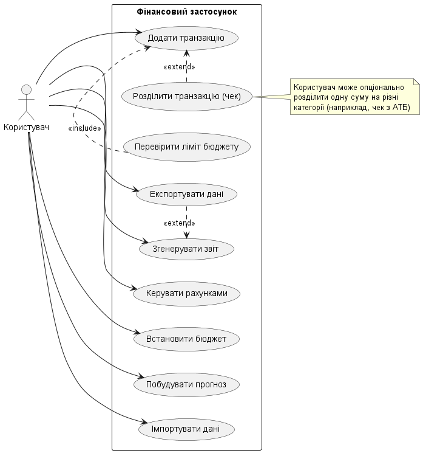
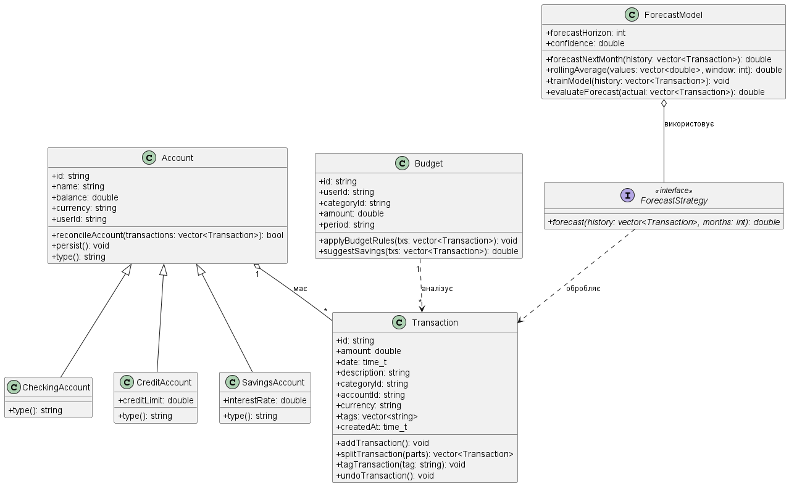
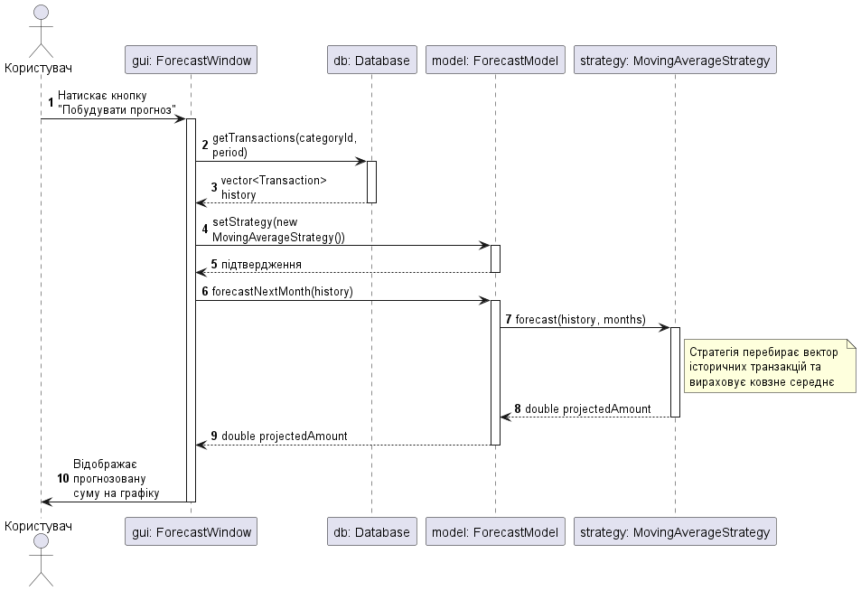
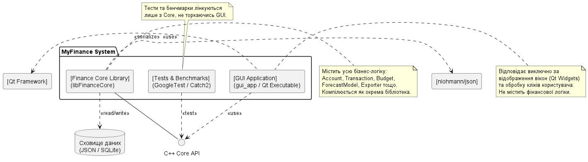
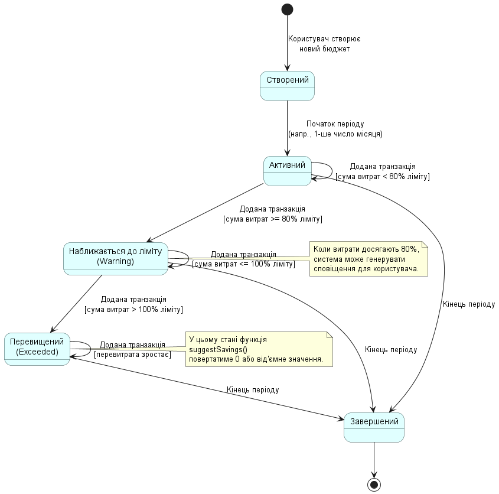
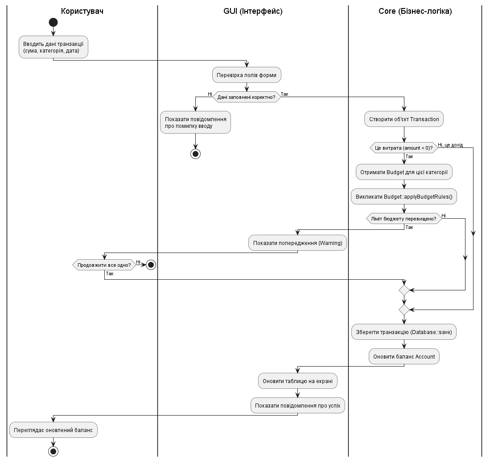
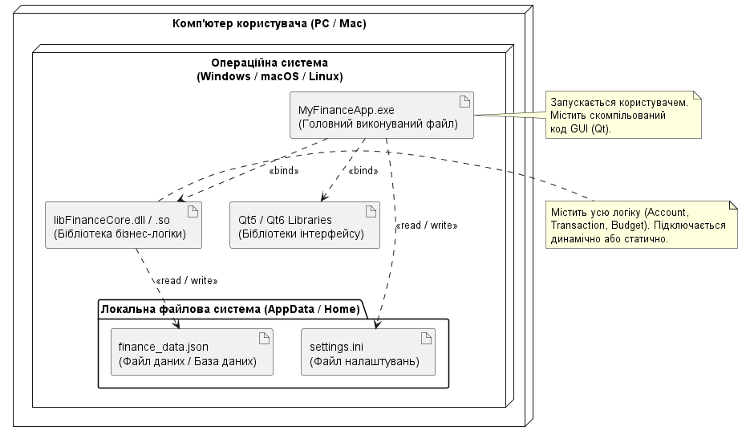
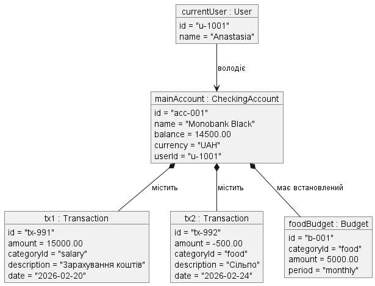
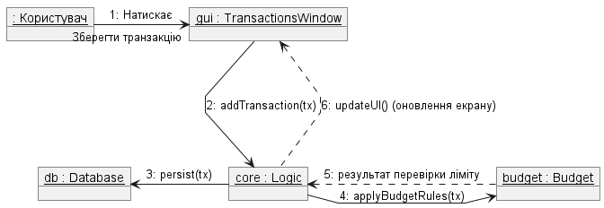
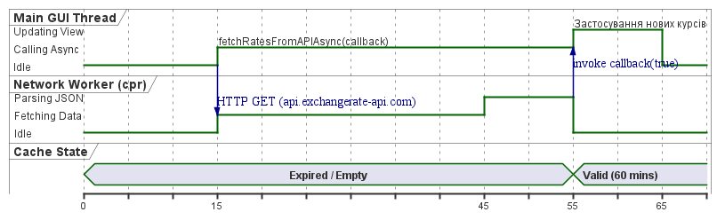

# Звіт про UML-моделювання системи "MyFinance"

Цей документ містить опис та візуалізацію архітектурних рішень проєкту.

---

## 1. Діаграма прецедентів (Use Case Diagram)

**Опис:** Визначає межі системи та її функціональність для користувача. Основні сервіси: облік транзакцій, бюджетування та прогнозний аналіз.

## 2. Діаграма класів (Class Diagram)

**Опис:** Статична структура. Демонструє ієрархію рахунків (`CheckingAccount`, `CreditAccount`, `SavingsAccount`) та використання патерна "Стратегія" для розрахунків.

## 3. Діаграма послідовностей (Sequence Diagram)

**Опис:** Потік повідомлень під час додавання витрати. Включає взаємодію між UI, логікою та базою даних.

## 4. Діаграма компонентів (Component Diagram)

**Опис:** Фізична архітектура. Проєкт розділено на бібліотеку ядра (`fixed`) та клієнтський додаток (`gui_app`).

## 5. Діаграма станів (State Diagram)

**Опис:** Динаміка об'єкта `Budget`. Показує переходи між станами активності та попередження про перевищення ліміту.

## 6. Діаграма діяльностей (Activity Diagram)

**Опис:** Алгоритм генерації звіту. Відображає логічні розгалуження та цикли обробки даних перед експортом.

## 7. Діаграма розгортання (Deployment Diagram)

**Опис:** Фізичне середовище. Додаток виконується як десктопна програма, що використовує локальне JSON-сховище для збереження стану.

## 8. Діаграма об'єктів (Object Diagram)

**Опис:** Знімок пам'яті системи з реальними даними рахунку користувача Anastasia.

## 9. Діаграма комунікацій (Communication Diagram)

**Опис:** Структурна організація об'єктів, що взаємодіють через об'єкт-контролер `Logic` для виконання фінансових операцій.

## 10. Оглядова діаграма взаємодії (Interaction Overview)

**Опис:** Високорівнева модель, що поєднує логіку керування процесами аналітики та імпорту даних.

## 11. Діаграма часу (Timing Diagram)

**Опис:** Часові характеристики ініціалізації модулів та завантаження даних із диска при старті застосунку.